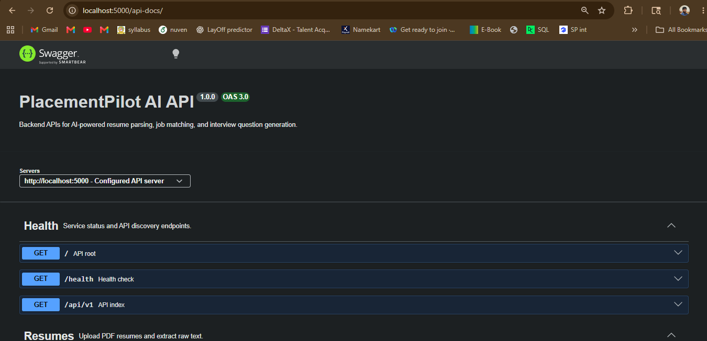
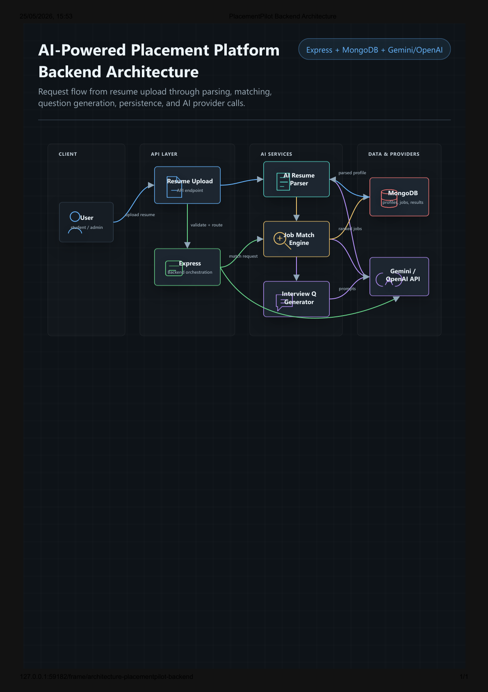
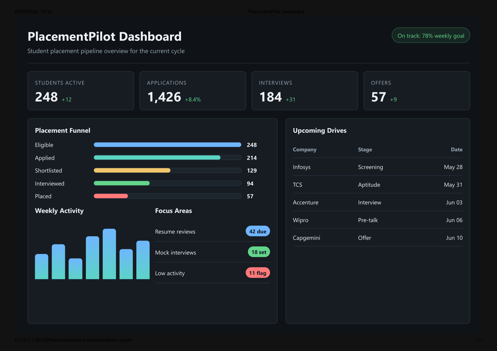
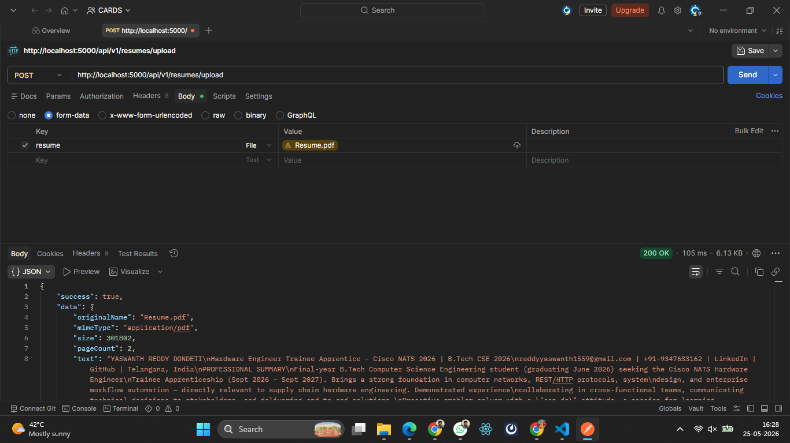
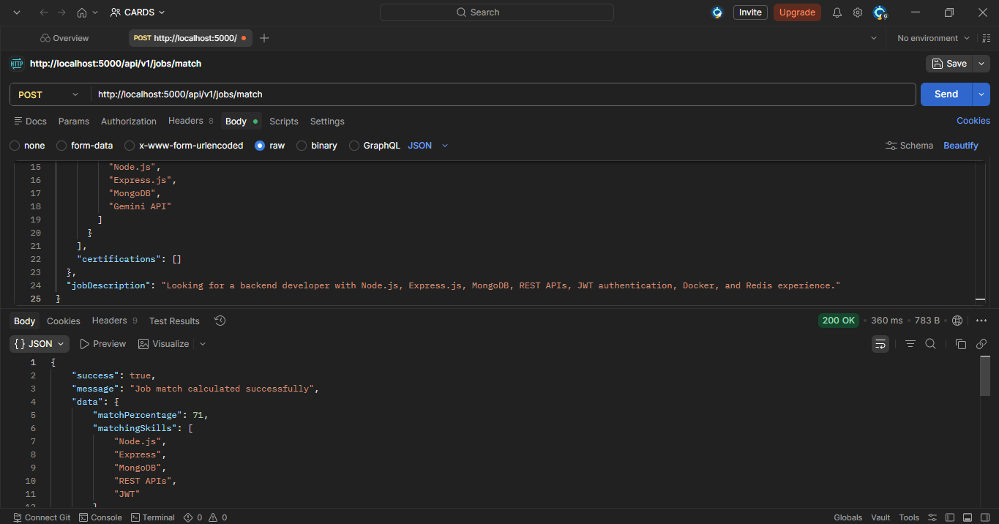
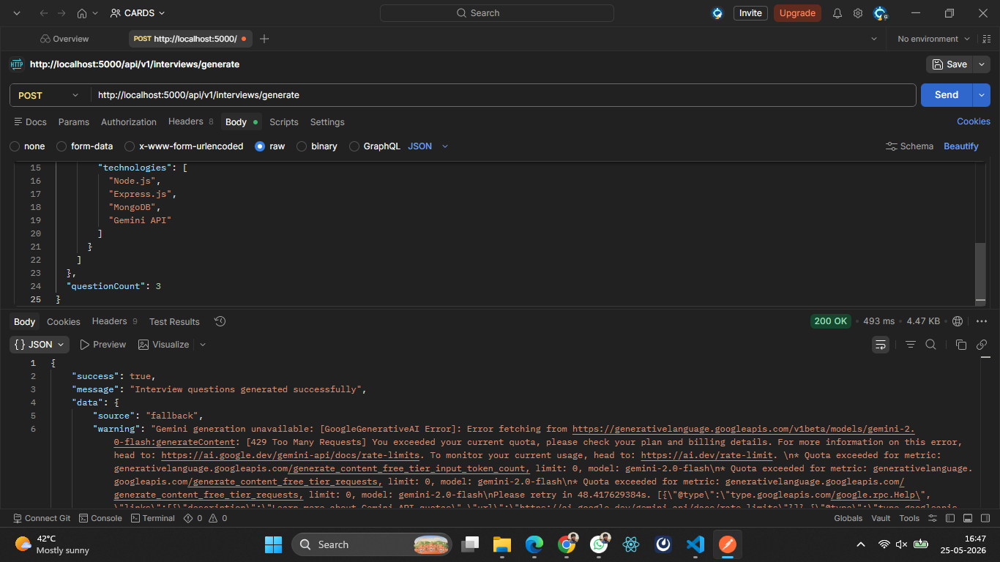

# PlacementPilot AI

## Overview

PlacementPilot AI is an AI-powered Express.js backend platform for resume parsing, job matching, and interview question generation.

The platform simulates a modern AI-assisted placement workflow using Node.js, Express.js, MongoDB, Gemini AI, and Swagger/OpenAPI documentation.

The project follows a clean production-style route-controller-service architecture with centralized error handling, environment-based configuration, modular services, and resilient fallback logic for AI provider failures.

---

## Live Links

* Live API: https://placementpilot-ai.onrender.com
* Swagger Docs: https://placementpilot-ai.onrender.com/api-docs
* GitHub Repository: https://github.com/YOUR_USERNAME/placementpilot-ai

---

## Features

* Upload PDF resumes using `multer`
* Extract raw resume text using `pdf-parse`
* AI-powered structured resume analysis using Gemini
* Extract:

  * skills
  * education
  * projects
  * certifications
* AI-assisted job matching
* Match percentage calculation
* Missing skill identification
* Technical, HR, and project-based interview question generation
* Difficulty levels and short model answers
* Swagger/OpenAPI documentation
* Centralized error handling
* Deterministic fallback logic if Gemini quota or availability fails
* Production-style Express backend architecture

---

## Tech Stack

* Node.js
* Express.js
* MongoDB
* Mongoose
* Gemini API (`@google/generative-ai`)
* Multer
* pdf-parse
* dotenv
* cors
* swagger-ui-express
* swagger-jsdoc
* nodemon

---

## Architecture

```text
Client
  |
  v
Express App (src/app.js)
  |
  +-- /api/v1/resumes
  |   +-- resumeRoutes
  |   +-- resumeController
  |   +-- resumeService
  |   +-- uploadMiddleware
  |
  +-- /api/v1/jobs
  |   +-- jobRoutes
  |   +-- jobController
  |   +-- jobMatchService
  |
  +-- /api/v1/interviews
  |   +-- interviewRoutes
  |   +-- interviewController
  |   +-- interviewService
  |
  +-- /api-docs
  |   +-- Swagger UI
  |
  v
MongoDB / Gemini API
```

---

## AI Workflow

1. A user uploads a PDF resume.
2. The resume upload API temporarily stores the uploaded file.
3. `pdf-parse` extracts raw text from the PDF.
4. Gemini transforms resume text into structured JSON:

   * skills
   * education
   * projects
   * certifications
5. The job matching service compares structured resume data with job descriptions.
6. Gemini extracts job skills and calculates match quality.
7. The interview generator creates technical, HR, and project-based interview questions.

---

## Fallback Reliability Strategy

PlacementPilot AI is designed with resilient fallback handling:

* Resume parsing works independently of Gemini.
* Uploaded files are cleaned automatically after processing.
* Gemini responses are normalized and validated into structured JSON.
* Job matching automatically falls back to deterministic local skill matching if Gemini quota or availability issues occur.
* Interview generation falls back to deterministic interview questions if AI services are unavailable.
* Centralized Express error middleware handles all async route failures.
* Production responses suppress stack traces for security.

---

## How Jetro Was Used

Jetro AI Workspace was used extensively during development for:

* backend architecture planning
* workflow visualization
* AI-assisted backend scaffolding
* controller-service architecture generation
* Swagger/OpenAPI setup
* debugging and iterative backend refinement
* architecture diagram generation
* dashboard prototyping
* API workflow design

The Jetro Research Board was used to visualize request flow, backend orchestration, AI services, database interaction, and API structure.

---

## API Documentation

| Method | Endpoint                      | Description                              |
| ------ | ----------------------------- | ---------------------------------------- |
| `GET`  | `/`                           | API metadata                             |
| `GET`  | `/health`                     | Health check                             |
| `GET`  | `/api/v1`                     | API index                                |
| `POST` | `/api/v1/resumes/upload`      | Upload PDF resume and extract text       |
| `POST` | `/api/v1/jobs/match`          | Match resume data with a job description |
| `POST` | `/api/v1/interviews/generate` | Generate interview questions             |
| `GET`  | `/api-docs`                   | Swagger UI                               |

---

## Setup Instructions

Install dependencies:

```bash
npm install
```

Create environment file:

```bash
cp .env.example .env
```

Update `.env` with:

* MongoDB connection string
* Gemini API key

Run in development:

```bash
npm run dev
```

Run in production:

```bash
npm start
```

---

## Environment Variables

```env
PORT=5000
MONGO_URI=your_mongodb_uri
JWT_SECRET=your_secret
GEMINI_API_KEY=your_key
GEMINI_MODEL=gemini-2.0-flash
NODE_ENV=development
CORS_ORIGIN=*
JSON_BODY_LIMIT=1mb
```

| Variable          | Purpose                   |
| ----------------- | ------------------------- |
| `NODE_ENV`        | Runtime environment       |
| `PORT`            | Server port               |
| `MONGO_URI`       | MongoDB connection URI    |
| `CORS_ORIGIN`     | Allowed frontend origins  |
| `JSON_BODY_LIMIT` | Maximum request body size |
| `GEMINI_API_KEY`  | Gemini API key            |
| `GEMINI_MODEL`    | Gemini model              |

---

## API Examples

### Resume Upload

```bash
curl -X POST http://localhost:5000/api/v1/resumes/upload \
  -F "resume=@resume.pdf"
```

### Job Match

```bash
curl -X POST http://localhost:5000/api/v1/jobs/match \
  -H "Content-Type: application/json" \
  -d '{
    "resumeData": {
      "skills": ["Node.js", "Express", "MongoDB", "REST APIs"]
    },
    "jobDescription": "Looking for Node.js developer with Express, MongoDB, Docker and JWT"
  }'
```

### Interview Generator

```bash
curl -X POST http://localhost:5000/api/v1/interviews/generate \
  -H "Content-Type: application/json" \
  -d '{
    "resumeData": {
      "skills": ["Node.js", "MongoDB", "REST APIs"]
    }
  }'
```

---

## Swagger Documentation

Start the server and open:

```text
http://localhost:5000/api-docs
```

Swagger includes:

* endpoint descriptions
* request examples
* response schemas
* multipart upload documentation

---

## Screenshots

### Swagger Documentation



### Backend Architecture



### Placement Dashboard



### Resume Upload API



### Job Match API



### Interview Generator API



---

## Deployment

Recommended deployment platforms:

* Render
* Railway

Production recommendations:

* Use HTTPS
* Add API rate limiting
* Store secrets securely
* Configure strict CORS
* Add monitoring and logging
* Rotate credentials periodically

Production install:

```bash
npm install --omit=dev
npm start
```
